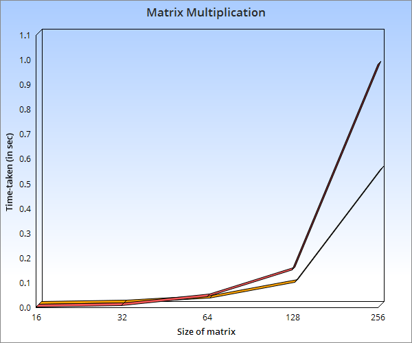

# Matrix Multiplication

 Let us consider two matrices X and Y. We want to calculate the resultant matrix Z by multiplying X and Y.

## What's Included

### Naive Method

The conventional matrix multiplication is the most important way to multiply matrices, and it is the fundamental basic of other algorithms. The definition of matrix multiplication is only valid if the width of first matrix equals the height of the second matrix. For a matrix A with dimensions m by n, and B with dimensions n by p, the result of A multiply B is an m by p matrix. Here, we assume that integer operations take O(1) time. There will be three for loops in this algorithm and one is nested in other. Hence, the algorithm runs in <b>O(n3)</b>

### Strassen's Method

Strassen’s algorithm reduces the number of multiplications required for computing the product of two 2 × 2 matrices A and B from eight to seven, by expressing the entries of AB as linear combinations of products of linear combinations of the entries of A and B. This trick, applied to four blocks of 2n×2n matrices, reduces the problem to seven multiplications of 2n–1×2n–1 matrices. Strassen’s algorithm carries the same aspect of Block matrix multiplication, and using the divide and conquers technique to perform faster. Recursive application gives an algorithm that runs in <b>O(nlog27)</b> = <b>O(n2.81)</b> 
  
### Comparison
Red line represents naive method and yellow line represents strassen's matrix multiplication algorithm.

